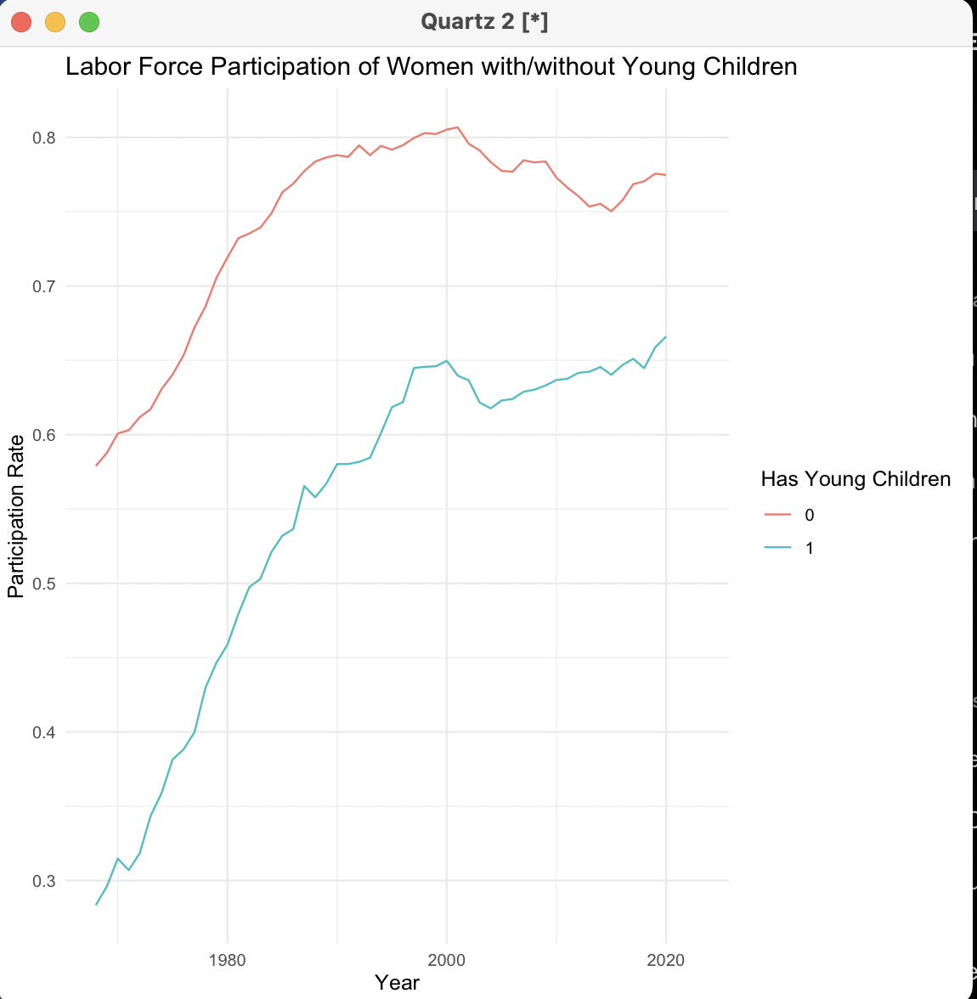
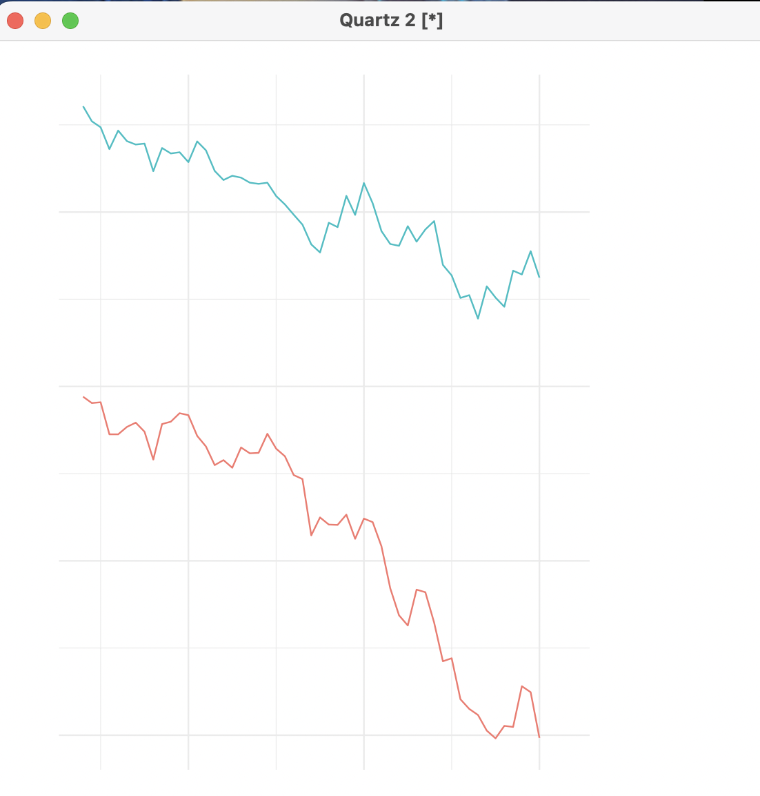

<a name="readme-top"></a>

<div align="center">

[![Contributors][contributors-shield]][contributors-url]
[![Forks][forks-shield]][forks-url]
[![Stargazers][stars-shield]][stars-url]
[![Issues][issues-shield]][issues-url]
[![LinkedIn][linkedin-shield]][linkedin-url]
</div>

<br />
<div align="center">
  <a href="https://github.com/Izaacapp/R-Script">
    
  </a>

  <h3 align="center">Labor Force Participation Analysis</h3>

  <p align="center">
    Analyzing labor force participation trends using IPUMS data
    <br />
    <a href="https://github.com/Izaacapp/R-Script"><strong>Explore the docs »</strong></a>
    <br />
    <br />
    ·
    <a href="https://github.com/Izaacapp/R-Script/issues/new?labels=bug&template=bug-report---.md">Report Bug</a>
    ·
    <a href="https://github.com/Izaacapp/R-Script/issues/new?labels=enhancement&template=feature-request---.md">Request Feature</a>
  </p>
</div>

<details>
  <summary>Table of Contents</summary>
  <ol>
    <li><a href="#about-the-project">About The Project</a></li>
    <li><a href="#built-with">Built With</a></li>
    <li><a href="#getting-started">Getting Started</a></li>
    <li><a href="#contributing">Contributing</a></li>
    <li><a href="#license">License</a></li>
    <li><a href="#contact">Contact</a></li>
    <li><a href="#acknowledgments">Acknowledgments</a></li>
  </ol>
</details>

## About The Project

This project analyzes labor force participation trends using data from the Integrated Public Use Microdata Series (IPUMS). The analysis includes labor force participation rates by sex over time, and participation rates of women and men with and without young children.

### Built With

* [![R][R]][R-url]
* [![dplyr][dplyr]][dplyr-url]
* [![ggplot2][ggplot2]][ggplot2-url]

## Getting Started

### Prerequisites

Ensure that you have R installed on your system. You'll also need the following R packages:

- `dplyr`
- `ggplot2`
- `readr`

You can install these packages using the following commands:

```r
install.packages("dplyr")
install.packages("ggplot2")
install.packages("readr")
```

### Installation

1. Download the dataset from IPUMS and place it in a known directory.
2. Update the file path in the R script to point to the location of the downloaded file.

### Data Preparation

1. Download the dataset from [IPUMS Current Population Survey (CPS)](https://cps.ipums.org/cps-action/data_requests/download) and place it in a known directory.
2. Update the file path in the R script to point to the location of the downloaded file.

### Running the Script

The provided R script reads the data, transforms it, and generates the plots. Below is a breakdown of the steps in the script:

1. **Install and Load Necessary Libraries**

   ```r
   # Install required packages if not already installed
   install.packages("dplyr")
   install.packages("ggplot2")
   install.packages("readr")

   # Load the necessary libraries
   library(dplyr)
   library(ggplot2)
   library(readr)
   ```

2. **Define Column Widths and Read Data**

   Define the column widths and names for the fixed-width file, and read in the data:

   ```r
   # Define the widths and column names for the fixed-width file
   widths <- fwf_widths(
     c(4, 11, 2, 1, 1, 1),
     c("year", "asecwt", "age", "sex", "nchlt5", "labforce")
   )

   # Set the file path to the .dat.gz file
   file_path <- "/path/to/your/dataset/cps_00002 2.dat.gz"

   # Normalize the file path to handle spaces or special characters
   file_path_normalized <- normalizePath(file_path, mustWork = TRUE)

   # Read the data using the normalized path
   data <- read_fwf(gzfile(file_path_normalized), widths)
   ```

3. **Transform the Data**

   Mutate the data to ensure all variables are in the correct format and create new variables needed for the analysis:

   ```r
   data <- data %>%
     mutate(
       year = as.integer(year),
       age = as.integer(age),
       sex = factor(sex, levels = c("1", "2"), labels = c("Male", "Female")),
       nchlt5 = as.integer(nchlt5),
       labforce = as.integer(labforce),
       asecwt = as.numeric(asecwt),
       in_labor_force = if_else(labforce == 2, 1, 0),
       has_young_children = if_else(nchlt5 >= 1, 1, 0)
     ) %>%
     filter(age >= 20 & age <= 50, labforce != 0)
   ```

4. **Generate Plots**

   - **Labor Force Participation by Sex Over Time**

     ```r
     participation_by_sex_year <- data %>%
       group_by(year, sex) %>%
       summarize(lfp_rate = weighted.mean(in_labor_force, asecwt, na.rm = TRUE), .groups = 'drop')

     ggplot(participation_by_sex_year, aes(x = year, y = lfp_rate, color = sex)) +
       geom_line() +
       labs(title = "Labor Force Participation by Sex Over Time",
            x = "Year", y = "Participation Rate") +
       theme_minimal()
     ```

     

   - **Labor Force Participation of Women with/without Young Children Over Time**

     ```r
     participation_women_children <- data %>%
       filter(sex == "Female") %>%
       group_by(year, has_young_children) %>%
       summarize(lfp_rate = weighted.mean(in_labor_force, asecwt, na.rm = TRUE), .groups = 'drop')

     ggplot(participation_women_children, aes(x = year, y = lfp_rate, color = factor(has_young_children))) +
       geom_line() +
       labs(title = "Labor Force Participation of Women with/without Young Children",
            x = "Year", y = "Participation Rate", color = "Has Young Children") +
       theme_minimal()
     ```

     

   - **Labor Force Participation of Men with/without Young Children Over Time**

     ```r
     participation_men_children <- data %>%
       filter(sex == "Male") %>%
       group_by(year, has_young_children) %>%
       summarize(lfp_rate = weighted.mean(in_labor_force, asecwt, na.rm = TRUE), .groups = 'drop')

     ggplot(participation_men_children, aes(x = year, y = lfp_rate, color = factor(has_young_children))) +
       geom_line() +
       labs(title = "Labor Force Participation of Men with/without Young Children",
            x = "Year", y = "Participation Rate", color = "Has Young Children") +
       theme_minimal()
     ```

     

## Conclusion

By following these steps, you can recreate the analysis and generate the plots demonstrating labor force participation trends. Ensure that your dataset is correctly formatted and that all necessary variables are included for accurate analysis.

## Contributing

"Every great advance in science has issued from a new audacity of imagination." - Niels Bohr

Contributions are what make the open source community such an amazing place to learn, inspire, and create. Any contributions you make are **greatly appreciated**.

If you have a suggestion that would make this better, please fork the repo and create a pull request. You can also simply open an issue with the tag "enhancement". Don't forget to give the project a star! Thanks again!

1. Fork the Project
2. Create your Feature Branch (`git checkout -b feature/AmazingFeature`)
3. Commit your Changes (`git commit -m 'Add some AmazingFeature'`)
4. Push to the Branch (`git push origin feature/AmazingFeature`)
5. Open a Pull Request

## License

Distributed under the MIT License. See `MIT-LICENSE.txt` for more information.

## Contact

Izaac Plambeck - [@Izaacapp](https://x.com/Izaacapp) - izaacap@gmail.com

Project

 Link: [https://github.com/Izaacapp/R-Script](https://github.com/Izaacapp/R-Script)

## Acknowledgments

* [IPUMS](https://ipums.org)
* [RStudio](https://rstudio.com)
* [Tidyverse](https://www.tidyverse.org)

<p align="right">(<a href="#readme-top">back to top</a>)</p>

<!-- MARKDOWN LINKS & IMAGES -->
[contributors-shield]: https://img.shields.io/github/contributors/Izaacapp/R-Script.svg?style=for-the-badge
[contributors-url]: https://github.com/Izaacapp/R-Script/graphs/contributors
[forks-shield]: https://img.shields.io/github/forks/Izaacapp/R-Script.svg?style=for-the-badge
[forks-url]: https://github.com/Izaacapp/R-Script/network/members
[stars-shield]: https://img.shields.io/github/stars/Izaacapp/R-Script.svg?style=for-the-badge
[stars-url]: https://github.com/Izaacapp/R-Script/stargazers
[issues-shield]: https://img.shields.io/github/issues/Izaacapp/R-Script.svg?style=for-the-badge
[issues-url]: https://github.com/Izaacapp/R-Script/issues
[license-shield]: https://img.shields.io/github/license/Izaacapp/R-Script.svg?style=for-the-badge
[license-url]: https://github.com/Izaacapp/R-Script/blob/master/LICENSE.txt
[linkedin-shield]: https://img.shields.io/badge/-LinkedIn-black.svg?style=for-the-badge&logo=linkedin&colorB=555
[linkedin-url]: https://www.linkedin.com/in/izaac-plambeck/
[product-screenshot]: images/screenshot.png
[R]: https://img.shields.io/badge/R-276DC3?style=for-the-badge&logo=r&logoColor=white
[R-url]: https://www.r-project.org/
[dplyr]: https://img.shields.io/badge/dplyr-276DC3?style=for-the-badge&logo=r&logoColor=white
[dplyr-url]: https://dplyr.tidyverse.org/
[ggplot2]: https://img.shields.io/badge/ggplot2-276DC3?style=for-the-badge&logo=r&logoColor=white
[ggplot2-url]: https://ggplot2.tidyverse.org/


