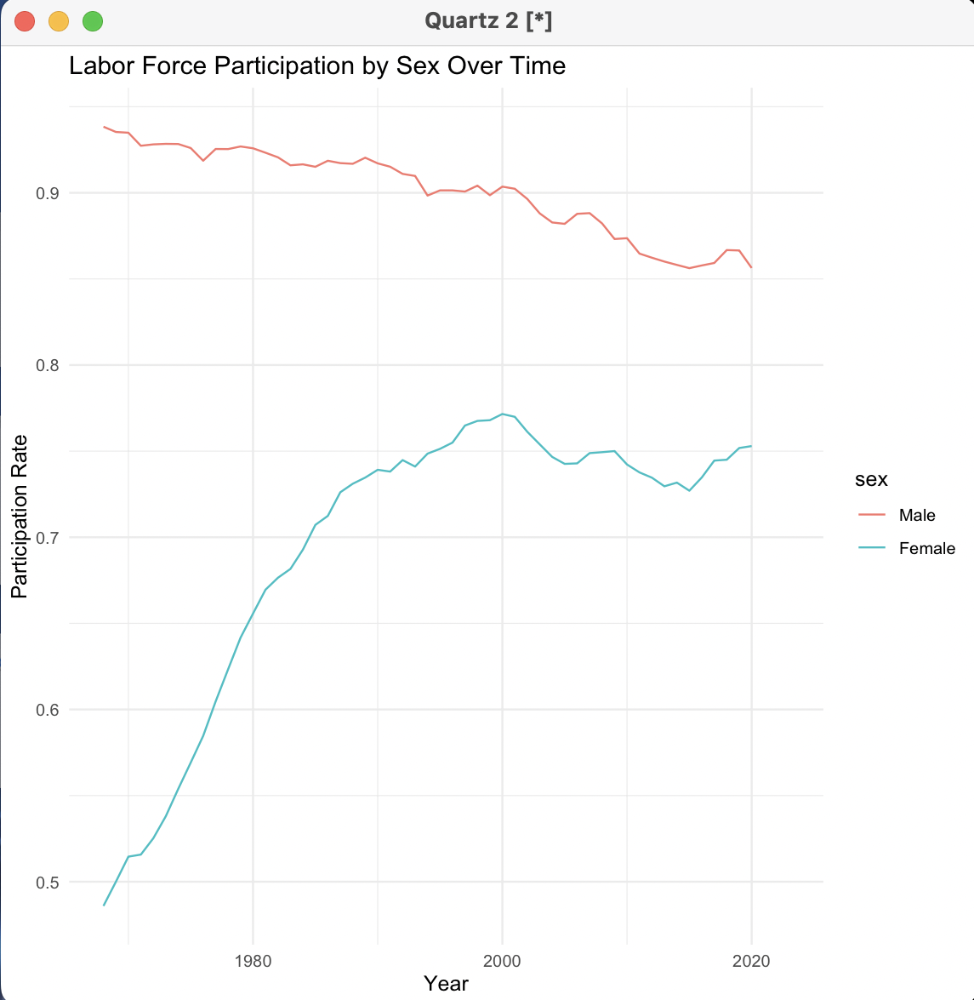

```markdown
<!-- Improved compatibility of back to top link: See: https://github.com/othneildrew/Best-README-Template/pull/73 -->
<a name="readme-top"></a>

<!-- PROJECT SHIELDS -->
<!--
*** I'm using markdown "reference style" links for readability.
*** Reference links are enclosed in brackets [ ] instead of parentheses ( ).
*** See the bottom of this document for the declaration of the reference variables
*** for contributors-url, forks-url, etc. This is an optional, concise syntax you may use.
*** https://www.markdownguide.org/basic-syntax/#reference-style-links
-->
[![Contributors][contributors-shield]][contributors-url]
[![Forks][forks-shield]][forks-url]
[![Stargazers][stars-shield]][stars-url]
[![Issues][issues-shield]][issues-url]
[![MIT License][license-shield]][license-url]
[![LinkedIn][linkedin-shield]][linkedin-url]

<!-- PROJECT LOGO -->
<br />
<div align="center">
  <h3 align="center">Labor Force Participation Analysis</h3>

  <p align="center">
    An analysis of labor force participation trends using data from the Integrated Public Use Microdata Series (IPUMS).
    <br />
    <a href="https://github.com/Izaacapp/R-Script"><strong>Explore the docs »</strong></a>
    <br />
    <br />
    <a href="https://github.com/Izaacapp/R-Script">View Demo</a>
    ·
    <a href="https://github.com/Izaacapp/R-Script/issues">Report Bug</a>
    ·
    <a href="https://github.com/Izaacapp/R-Script/issues">Request Feature</a>
  </p>
</div>

<!-- TABLE OF CONTENTS -->
<details>
  <summary>Table of Contents</summary>
  <ol>
    <li>
      <a href="#about-the-project">About The Project</a>
      <ul>
        <li><a href="#built-with">Built With</a></li>
      </ul>
    </li>
    <li>
      <a href="#getting-started">Getting Started</a>
      <ul>
        <li><a href="#prerequisites">Prerequisites</a></li>
        <li><a href="#installation">Installation</a></li>
      </ul>
    </li>
    <li><a href="#usage">Usage</a></li>
    <li><a href="#roadmap">Roadmap</a></li>
    <li><a href="#contributing">Contributing</a></li>
    <li><a href="#license">License</a></li>
    <li><a href="#contact">Contact</a></li>
    <li><a href="#acknowledgments">Acknowledgments</a></li>
  </ol>
</details>

<!-- ABOUT THE PROJECT -->
## About The Project

[](https://github.com/Izaacapp/R-Script)

This project analyzes labor force participation trends using data from the Integrated Public Use Microdata Series (IPUMS). The analysis includes labor force participation rates by sex over time, and participation rates of women and men with and without young children.

Here's why this project is useful:
* Understand labor force participation trends
* Analyze differences by sex and presence of young children
* Utilize data from a reliable source for accurate analysis

<p align="right">(<a href="#readme-top">back to top</a>)</p>

### Built With

* [R](https://www.r-project.org/)
* [dplyr](https://cran.r-project.org/web/packages/dplyr/index.html)
* [ggplot2](https://cran.r-project.org/web/packages/ggplot2/index.html)
* [readr](https://cran.r-project.org/web/packages/readr/index.html)

<p align="right">(<a href="#readme-top">back to top</a>)</p>

<!-- GETTING STARTED -->
## Getting Started

To get a local copy up and running follow these simple steps.

### Prerequisites

Ensure that you have R installed on your system. You'll also need the following R packages:

* `dplyr`
* `ggplot2`
* `readr`

You can install these packages using the following commands:

```r
install.packages("dplyr")
install.packages("ggplot2")
install.packages("readr")
```

### Installation

1. Clone the repo
   ```sh
   git clone https://github.com/Izaacapp/R-Script.git
   ```
2. Download the dataset from IPUMS and place it in a known directory.
3. Update the file path in the R script to point to the location of the downloaded file.

<p align="right">(<a href="#readme-top">back to top</a>)</p>

<!-- USAGE EXAMPLES -->
## Usage

The provided R script reads the data, transforms it, and generates the plots. Below is a breakdown of the steps in the script:

1. **Install and Load Necessary Libraries**

   ```r
   # Install required packages if not already installed
   install.packages("dplyr")
   install.packages("ggplot2")
   install.packages("readr")

   # Load the necessary libraries
   library(dplyr)
   library(ggplot2)
   library(readr)
   ```

2. **Define Column Widths and Read Data**

   Define the column widths and names for the fixed-width file, and read in the data:

   ```r
   # Define the widths and column names for the fixed-width file
   widths <- fwf_widths(
     c(4, 11, 2, 1, 1, 1),
     c("year", "asecwt", "age", "sex", "nchlt5", "labforce")
   )

   # Set the file path to the .dat.gz file
   file_path <- "/Users/beck/GitHub/myRepos/R-Script/cps_00002 2.dat.gz"

   # Normalize the file path to handle spaces or special characters
   file_path_normalized <- normalizePath(file_path, mustWork = TRUE)

   # Read the data using the normalized path
   data <- read_fwf(gzfile(file_path_normalized), widths)
   ```

3. **Transform the Data**

   Mutate the data to ensure all variables are in the correct format and create new variables needed for the analysis:

   ```r
   data <- data %>%
     mutate(
       year = as.integer(year),
       age = as.integer(age),
       sex = factor(sex, levels = c("1", "2"), labels = c("Male", "Female")),
       nchlt5 = as.integer(nchlt5),
       labforce = as.integer(labforce),
       asecwt = as.numeric(asecwt),
       in_labor_force = if_else(labforce == 2, 1, 0),
       has_young_children = if_else(nchlt5 >= 1, 1, 0)
     ) %>%
     filter(age >= 20 & age <= 50, labforce != 0)
   ```

4. **Generate Plots**

   - **Labor Force Participation by Sex Over Time**

     ```r
     participation_by_sex_year <- data %>%
       group_by(year, sex) %>%
       summarize(lfp_rate = weighted.mean(in_labor_force, asecwt, na.rm = TRUE), .groups = 'drop')

     ggplot(participation_by_sex_year, aes(x = year, y = lfp_rate, color = sex)) +
       geom_line() +
       labs(title = "Labor Force Participation by Sex Over Time",
            x = "Year", y = "Participation Rate") +
       theme_minimal()
     ```

     

   - **Labor Force Participation of Women with/without Young Children Over Time**

     ```r
     participation_women_children <- data %>%
       filter(sex == "Female") %>%
       group_by(year, has_young_children) %>%
       summarize(lfp_rate = weighted.mean(in_labor_force, asecwt, na.rm = TRUE), .groups = 'drop')

     ggplot(participation_women_children, aes(x = year, y = lfp_rate, color = factor(has_young_children))) +
       geom_line() +
       labs(title = "Labor Force Participation of Women with/without Young Children",
            x = "Year", y = "Participation Rate", color = "Has Young Children") +
       theme_minimal()
     ```

     

   - **Labor Force Participation of Men with/without Young Children Over Time**

     ```r
     participation_men_children <- data %>%
       filter(sex == "Male") %>%
       group_by(year, has_young_children) %>%
       summarize(lfp_rate = weighted.mean(in_labor_force, asecwt, na.rm = TRUE), .groups = 'drop')

     ggplot(participation_men_children, aes(x = year, y = lfp_rate, color = factor(has_young_children))) +
       geom_line() +
       labs(title = "Labor Force Participation of Men with/without Young Children",
            x = "Year", y =

 "Participation Rate", color = "Has Young Children") +
       theme_minimal()
     ```

     

<p align="right">(<a href="#readme-top">back to top</a>)</p>

<!-- ROADMAP -->
## Roadmap

- [ ] Add additional analysis
- [ ] Improve data visualization
- [ ] Add support for more datasets

See the [open issues](https://github.com/Izaacapp/R-Script/issues) for a full list of proposed features (and known issues).

<p align="right">(<a href="#readme-top">back to top</a>)</p>

<!-- CONTRIBUTING -->
## Contributing

Contributions are what make the open source community such an amazing place to learn, inspire, and create. Any contributions you make are **greatly appreciated**.

If you have a suggestion that would make this better, please fork the repo and create a pull request. You can also simply open an issue with the tag "enhancement".
Don't forget to give the project a star! Thanks again!

1. Fork the Project
2. Create your Feature Branch (`git checkout -b feature/AmazingFeature`)
3. Commit your Changes (`git commit -m 'Add some AmazingFeature'`)
4. Push to the Branch (`git push origin feature/AmazingFeature`)
5. Open a Pull Request

<p align="right">(<a href="#readme-top">back to top</a>)</p>

<!-- LICENSE -->
## License

Distributed under the MIT License. See `LICENSE.txt` for more information.

<p align="right">(<a href="#readme-top">back to top</a>)</p>

<!-- CONTACT -->
## Contact

Izaac Plambeck - [@your_twitter](https://twitter.com/your_username) - email@example.com

Project Link: [https://github.com/Izaacapp/R-Script](https://github.com/Izaacapp/R-Script)

<p align="right">(<a href="#readme-top">back to top</a>)</p>

<!-- ACKNOWLEDGMENTS -->
## Acknowledgments

* [IPUMS](https://ipums.org)
* [R Documentation](https://www.rdocumentation.org/)
* [ggplot2 Documentation](https://ggplot2.tidyverse.org/)
* [dplyr Documentation](https://dplyr.tidyverse.org/)
* [readr Documentation](https://readr.tidyverse.org/)
* [Choose an Open Source License](https://choosealicense.com)
* [GitHub Emoji Cheat Sheet](https://www.webpagefx.com/tools/emoji-cheat-sheet)
* [Img Shields](https://shields.io)
* [GitHub Pages](https://pages.github.com)
* [Font Awesome](https://fontawesome.com)
* [React Icons](https://react-icons.github.io/react-icons/search)

<p align="right">(<a href="#readme-top">back to top</a>)</p>

<!-- MARKDOWN LINKS & IMAGES -->
<!-- https://www.markdownguide.org/basic-syntax/#reference-style-links -->
[contributors-shield]: https://img.shields.io/github/contributors/Izaacapp/R-Script.svg?style=for-the-badge
[contributors-url]: https://github.com/Izaacapp/R-Script/graphs/contributors
[forks-shield]: https://img.shields.io/github/forks/Izaacapp/R-Script.svg?style=for-the-badge
[forks-url]: https://github.com/Izaacapp/R-Script/network/members
[stars-shield]: https://img.shields.io/github/stars/Izaacapp/R-Script.svg?style=for-the-badge
[stars-url]: https://github.com/Izaacapp/R-Script/stargazers
[issues-shield]: https://img.shields.io/github/issues/Izaacapp/R-Script.svg?style=for-the-badge
[issues-url]: https://github.com/Izaacapp/R-Script/issues
[license-shield]: https://img.shields.io/github/license/Izaacapp/R-Script.svg?style=for-the-badge
[license-url]: https://github.com/Izaacapp/R-Script/blob/master/LICENSE.txt
[linkedin-shield]: https://img.shields.io/badge/-LinkedIn-black.svg?style=for-the-badge&logo=linkedin&colorB=555
[linkedin-url]: https://linkedin.com/in/izaac-plambeck
```

